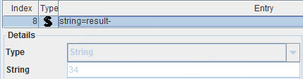

# 1. 前言

Java项目中经常会引入一些未使用的Jar包，会增大项目发布包体积，也可能会带来一些额外的维护成本。通过手工方式查找未使用的Jar包，是一件费时费力的事。

以下提供Linux环境shell脚本（编写环境为GNU bash, version 4.2.46(1)-release (x86_64-redhat-linux-gnu)），用于快速自动化查找Java项目引入但未使用的Jar包，以及Jar包中的代码相互之间的调用关系。

# 2. 原理

参考“Chapter 4. The class File Format”（ https://docs.oracle.com/javase/specs/jvms/se8/html/jvms-4.html#jvms-4.4 ）关于class文件结构的说明。

## 2.1. 类名在class文件中的存储格式

在class文件结构中，类名与接口名总是以完整名称形式出现，被称为二进制名称。这些名称总是以CONSTANT_Utf8_info结构表示。

例如，Thread类的常规二进制名称是“java.lang.Thread”。在class文件格式的内部形式使用的描述符中，Thread类名的引用以CONSTANT_Utf8_info结构实现，使用字符串“java/lang/Thread”表示。

CONSTANT_Utf8_info结构用于表示常量字符串值。

CONSTANT_Utf8_info结构中的字符串内容使用被修改的UTF-8编码。被修改的UTF-8字符串经过编码，每个编码点可以使用一个字节表示仅包含非空ASCII字符的编码点序列。

## 2.2. 字符串在class文件中的存储格式

Java虚拟机指令引用常量池表中的符号信息，常量池类型包含CONSTANT_String。

CONSTANT_String_info结构用于表示String类型的常量对象，该结构中包含tag项与string_index项。

tag项的值为CONSTANT_String (8)；

string_index项的值必须是一个指向常量池表的有效索引。以上索引对应的常量池条目必须是一个CONSTANT_Utf8_info结构，代表会被初始化到String对象的Unicode编码指向的序列。

根据以上说明可知，类名在class文件中对应CONSTANT_Utf8_info结构；字符串在class文件中为CONSTANT_String_info结构，CONSTANT_String_info结构存在对应的CONSTANT_Utf8_info结构。CONSTANT_Utf8_info结构对应被修改的UTF-8编码的字符串。

## 2.3. 分析class文件格式的工具

使用Java Class File Editor工具，可以分析class文件格式。

该工具的说明可参考 http://classeditor.sourceforge.net/ ，可从 https://sourceforge.net/projects/classeditor/files/ 下载。

## 2.4. 测试代码

使用以下代码，用于验证使用import引入类的格式：

```java
import java.math.BigDecimal;

public class Test {
    public static void main(String[] args) {
        BigDecimal a = BigDecimal.ZERO;
    }
}
```

使用以下代码，用于验证使用动态加载引入类的格式：

```java
public class Test2 {
    public static void main(String[] args) throws Exception {
        String className = "java.lang.StringBuilder";
        Class clazz = Class.forName(className);
        Object o = clazz.newInstance();
        System.out.println("result-" + o.getClass().getName());
    }
}
```

## 2.5. 验证class文件中被引入类的格式

### 2.5.1. 使用import引入类的格式

使用Java Class File Editor工具打开上述编译生成的Test.class文件，查看“Constant Pool”页，可以看到类型为“Utf8”的常量，值为“java/math/BigDecimal”，与class文件结构说明相符。


### 2.5.2. 使用动态加载引入类的格式

打开Test2.class文件，可以看到类型为String，条目为“java.lang.StringBuilder”，String值为27的常量。

查看索引为27的常量，类型为“Utf8”，值为“java.lang.StringBuilder”


还可以看到类型为String，条目为“result-”，String值为34的常量。

查看索引为34的常量，类型为“Utf8”，值为“result-”。




以上与class文件结构说明相符。

## 2.6. 在class文件中根据字符串查找引用的类信息

在Linux环境使用查看文本文件的命令查看class文件，或使用strings命令获取class文件中的可打印字符串，可以看到class文件内容中包含引入的Java类名字符串，使用其他操作系统文本编辑器打开class文件也可以看到。

使用import引入类时，在class文件中，被引入的类名使用“/”作为分隔符；使用动态加载引入类时，在class文件中，被引入的类名使用“.”作为分隔符（不考虑被引入类名被编码、加密等情况）。

在Linux环境使用grep命令在class文件中搜索Java类名字符串，能够搜索到，提示“Binary file xxx.class1 matches”。

以下在查找Jar包中的类之间的使用关系时，使用grep命令进行搜索，在搜索时包含以“/”及“.”作为类名分隔符的情况。

# 3. 检查单个Jar包是否被其他Jar包使用

使用当前目录的“check_jar_used.sh”脚本，可以查找指定的某个Jar包中的所有class文件是否被其他Jar包中的class文件使用，使用Jar包中的完整类名查找其是否被其他Jar包中的class文件使用。

## 3.1. 执行步骤

以上脚本的执行步骤如下：

- 将当前目录（lib目录拷贝的目录）中的全部jar文件解压到对应的目录中，目录名为Jar包的名字后加上“-dir”，若目录已存在则不再解压；

- 获得指定Jar包中的全部类名，并写入文件（文件内容前半部分以“/”作为分隔符，后半部分以“.”作为分隔符）；

- 在当前目录其他Jar包目录的class文件中，根据以上生成的文件，搜索指定Jar包中的全部类名，是否有被使用。

## 3.2. 使用说明

建议将服务器Java项目的lib目录复制为一个新的目录，将以上脚本上传至该目录中，执行“sh check_jar_used.sh xxx.jar”或“sh check_jar_used.sh xxx.jar n”。

以上脚本的参数1为需要检查的Jar包文件名；

当不指定参数2时，从其他Jar包的class文件中搜索指定Jar包的类名时，当找到第一个有使用的类时就会退出，脚本执行耗时会较短（若确实有找到），用于检查单个Jar包是否被其他Jar包使用；

当指定参数2时，从其他Jar包的class文件中搜索指定Jar包的类名时，当找到的有使用的类的数量达到参数2指定数量时才退出，脚本执行耗时会较长，用于检查单个Jar包被其他Jar包使用的详情（可将参数2设置为很大的值）。

## 3.3. 执行结果

以上脚本执行完毕后，会在对应Jar包的目录中生成两个文件：classes_slash_point.txt、used_jar_by_class.txt。

classes_slash_point.txt文件中保存了当前Jar包中的完整类名，包含以“/”及“.”为分隔符的形式。

used_jar_by_class.txt文件中保存了当前Jar包中的类被其他Jar包中的类使用的情况，该文件中保存的数据会去重，因此输出结果行数与执行上述脚本时指定的参数2可能会不相同。

例如对“spring-aop-5.0.17.RELEASE.jar”执行上述脚本，在spring-aop-5.0.17.RELEASE.jar-dir目录生成的classes_slash_point.txt文件内容示例如下：

```
org/springframework/aop/TruePointcut
org\.aopalliance\.aop\.Advice
```

在上述目录生成的used_jar_by_class.txt文件内容示例如下：

```
./spring-orm-5.0.8.RELEASE.jar-dir/org/springframework/orm/hibernate5/support/OpenSessionInterceptor.class:org/aopalliance/intercept/MethodInvocation
./spring-tx-5.0.17.RELEASE.jar-dir/org/springframework/dao/annotation/PersistenceExceptionTranslationAdvisor.class:org/aopalliance/aop/Advice
```

以上“:”左边的内容为其他Jar包中的类，右边的内容为当前Jar包中的类，左边的类有使用右边的类。

# 4. 自动查找所有引入但未使用的Jar包

使用当前目录的“search_unused_jars.sh”脚本，可以查找指定Java项目中未被Java项目本身及其他Jar包使用的Jar包。

在查找各Jar包的使用情况时，使用Jar包中的完整类名，查找其是否被Java项目本身的class、xml、properties、groovy等文件及其他Jar包的class文件使用，找到未使用的Jar包后，会将这部分Jar包重命名（将这部分Jar包排除，之后不会再处理这些Jar包），继续在剩余Jar包中查找未使用的Jar包（剩余Jar包可能仅被已被重命名的Jar包使用），直到剩余的所有Jar包都有被使用为止。

## 4.1. 执行步骤

### 4.1.1. 主要执行步骤

以上脚本的主要执行步骤如下：

- 将当前目录（lib目录拷贝的目录）中的全部jar文件解压到对应的目录中，目录名为Jar包的名字后加上“-dir”，若目录已存在则不再解压；

- 获得以上Jar包的全部类名，分别写入文件，每个Jar包会生成两个文件，一个文件内容以“/”、“.”作为分隔符，用于在class文件搜索当前Jar包的类是否有使用；另一个文件内容以“.”作为分隔符，用于在文本文件搜索；

- 将需要在文本文件中搜索是否有使用指定类名的对应目录写入文件；

- 执行外层循环。

### 4.1.2. 外层循环执行步骤

- 循环执行以下步骤

- 将需要在class文件中搜索是否有使用指定类名的对应目录写入文件，包含手工指定的目录（当前Java项目的classes目录），以及当前目录现有jar文件对应目录；

- 调用以下“查找所有的Jar包中的class文件是否有被使用”步骤；

- 检查上一步生成的保存未使用的Jar包的文件是否为空，若为空则说明未使用的Jar包已处理完毕，结束循环。

### 4.1.3. 查找所有的Jar包中的class文件是否有被使用

- 遍历当前目录的所有jar文件，执行以下步骤；

- 检查当前jar文件是否在指定目录的class文件中被使用（调用以下“检查当前Jar包的类是否有被使用”步骤），若有被使用则继续下次循环；

- 检查当前jar文件是否在指定目录的文本文件中被使用（调用以下“检查当前Jar包的类是否有被使用”步骤），若有被使用则继续下次循环；

- 执行至此说明当前Jar包未被使用，将当前Jar包及对应目录重命名（重命名jar文件的目的是，使后缀为.jar的文件均为被使用的Jar包）。

### 4.1.4. 检查当前Jar包的类是否有被使用

- 读取保存了当前需要处理的目录的文件（可能为保存class文件的目录，或保存xml等文本文件的目录），遍历每一行对应的目录，进行以下处理；

- 判断当前处理的目录与当前处理的jar包的目录是否相同，若是则跳过当前目录的处理；

- 在目录的class文件中搜索是否有使用当前Jar包的类时，查找当前目录中的class文件，并对搜索到的文件内容进行搜索，搜索内容为当前Jar包的类名对应的文件，其分隔符包含“/”与“.”；当搜索到指定的行数后退出；将搜索结果保存至文件中；

- 在目录的xml等文本文件中搜索是否有使用当前Jar包的类时，查找当前目录中的xml等文本文件，并对搜索到的文件内容进行搜索，搜索内容为当前Jar包的类名对应的文件，其分隔符为“.”；下同；

- 判断以上生成的当前Jar包的类被使用情况的文件，若文件非空，则结束循环；

- 执行至此说明当前Jar包的类被使用情况的文件为空，即说明当前Jar包未被使用。

## 4.2. 使用说明

建议将服务器Java项目的lib目录复制为一个新的目录，将以上脚本上传至该目录中。

### 4.2.1. 执行脚本前需要生成的文件

以上脚本会从文件读取需要搜索的目录信息，从in_classes_dir.txt文件中读取需要在class文件中搜索是否有使用Jar包的类的目录，可指定为当前Java工程的classes目录；从in_config_dir.txt文件中读取需要在xml等文本文件中搜索是否有使用Jar包的类的目录，可指定为当前Java工程使用的配置文件所在目录。以上文件中每个目录占一行，都可以指定多个目录。

生成以上文件的示例如下：

```shell
classes_dir_file=in_classes_dir.txt
config_dir_file=in_config_dir.txt
>$classes_dir_file
>$config_dir_file

echo /data/tomcat/appname/apps/warname/WEB-INF/classes >> $classes_dir_file
echo /data/tomcat/appname/apps/warname/WEB-INF/ >> $config_dir_file
echo /data/tomcat/appname/conf/ >> $config_dir_file
```

### 4.2.2. 脚本参数

在生成以上文件后，可以执行上述脚本，执行“sh search_unused_jars.sh”或“sh search_unused_jars.sh n”。

当不指定参数1时，从class、xml等文件中搜索指定Jar包的类名时，当找到第一个有使用的类时就会退出，脚本执行耗时会较短（若确实有找到），用于查找未被当前Java项目或其他Jar包使用使用的Jar包；

当指定参数1时，从class、xml等文件中搜索指定Jar包的类名时，当找到有使用的类数量达到参数1指定的数量时才退出，脚本执行耗时会较长，用于检查所有Jar包被当前Java项目及其他Jar包使用的详情。

## 4.3. 执行结果

### 4.3.1. 被搜索的目录信息

在find_in目录中，生成了find_in_conf_dir.txt、find_in_class_dir-\[生成时间\].txt文件。

find_in_conf_dir.txt文件中保存了从xml等文本文件中搜索是否有使用Jar包中的类时对应的目录，包含执行脚本前向in_config_dir.txt文件写入的目录。

find_in_class_dir-xxx.txt文件中保存了从class文件中搜索是否有使用Jar包中的类时对应的目录，每轮外层循环会生成一个新的文件，包含执行脚本前向in_classes_dir.txt文件写入的目录，及当前目录中的jar文件对应目录。

### 4.3.2. 各Jar包的类名信息

在result_classes_info目录中，生成了各个Jar包的类名信息，每个Jar包对应两个文件：xxx.jar_point.txt与xxx.jar_slash_point.txt。

在xxx.jar_point.txt文件中，以“.”作为分隔符；在xxx.jar_slash_point.txt文件中，前半部分以“/”作为分隔符，后半部分以“.”作为分隔符。

### 4.3.3. 各Jar包的class文件被使用的信息

在result_used_jars_by_class目录中，生成了各Jar包中的类被当前Java工程或其他Jar包使用的情况，每个被使用的Jar包对应一个文件：xxx.jar.txt。

以上文件内容示例如下：

```
/data/tomcat/appname/apps/warname/WEB-INF/classes/aa/bb/C.class:org/springframework/stereotype/Service

/data/tomcat/appname/apps/warname/WEB-INF/classes/applicationContext.xml:org.mybatis.spring.mapper.MapperScannerConfigurer

./spring-aspects-5.0.17.RELEASE.jar-dir/org/springframework/cache/aspectj/AspectJJCacheConfiguration.class:org/springframework/cache/jcache/config/AbstractJCacheConfiguration
```

以上“:”左边的内容为当前Java项目中的类，或xml等文本文件，或其他Jar包中的类，右边的内容为被使用Jar包中的类，左边的文件中有使用右边的类。

### 4.3.4. 未被使用的Jar包信息

在result_unused_jars目录中，生成了未被使用的Jar包信息，每轮外层循环将找到的未被使用的Jar包名字写入对应的文件中，生成的文件名为by_class_\[生成时间\].txt。

以上文件每一行对应一个未被使用的Jar包名称，通过以上文件可以知道未被使用的Jar包。也可以通过查看当前目录中被重命名为xxx.jar.unused的文件，获得未被使用的Jar包。

### 4.3.5. 日志文件

在run_log目录中，生成了脚本的执行日志，run_prepare-\[生成时间\].log文件保存了脚本准备阶段的日志，每轮外层循环会生成一个run-\[生成时间\].log日志文件。

# 5. 其他说明

使用以上脚本查找到的未使用的Jar包供参考，还需要人工识别是否确实可以排除。在排除多余Jar包引入后，需要进行完备的测试。

执行以上search_unused_jars.sh脚本时，可将参数1设置为很大的值，可以查找Java项目引用的Jar包中的代码相互之间的调用关系。

使用以下脚本可以将.unused文件或目录恢复：

```shell
for file in $(find . -maxdepth 1 -name \*\.unused); do
    raw_name=$(echo $file | awk -F '.unused' '{print $1}')
    mv $file $raw_name
done
ls -lrt
```
